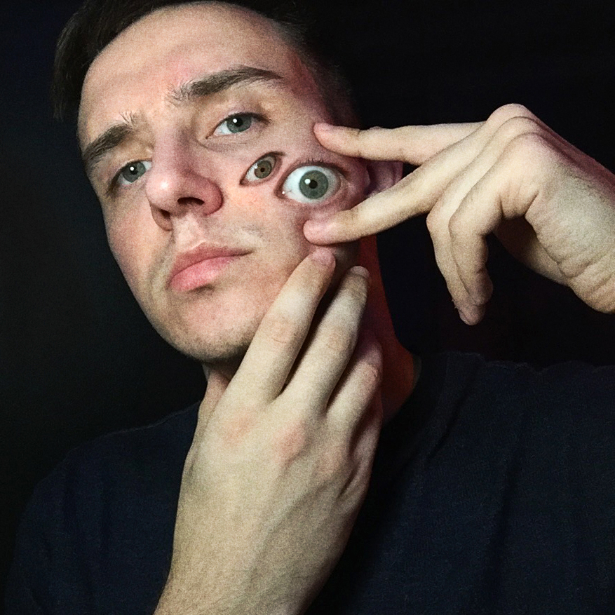

# My name is Ruslan Bogdanov

***

### My contacts:
* *Phone*: +7(925) 368-03-50
* *E-mail*: grymyl.rb@gmail.com
* *GitHub*: [XXXmez](https://github.com/XXXmez)
* *Discord*: Grymyl grymyl#1675

### About me
I really like web development, interface development, interactive elements on the page, every time I do something new I feel like I am taking a step forward. I believe that I will achieve my goals on the web

### Skills
* *HTML*
* *CSS*
* *JS*
* *GIT*

### Code example
```
function solution(str, ending){
    let a = str.length;
    let b = ending.length
    let c = a-b;
    let d = str.slice(c)
    return d == ending;
}
```

### Projects
* [Rsschool-cv](https://xxxmez.github.io/rsschool-cv/)
* [Weather-local](https://xxxmez.github.io/weather-local/)


### Education
* *Books*: 
  * Kyle Simpson - Book series - You don't know JS
  * David Flanagan - JavaScript. Complete guide
* *Courses*: 
  * Various courses and youtube
* *Сollege*:
  * Tula Social and Technical College

### Languages
* *English* — A1
